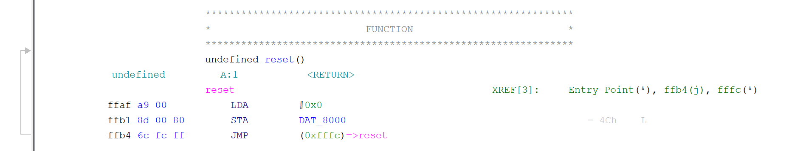
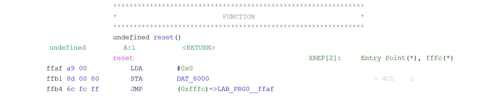

# GhidraNes

A Ghidra extension to support disassembling and analyzing NES ROMs.

## Features

- Import NES ROMs in the iNES format. The following mappers are supported:
    - [NROM](https://www.nesdev.org/wiki/NROM) (mapper 0)
    - [MMC1](https://www.nesdev.org/wiki/MMC1) (mapper 1)
    - [UxROM](https://www.nesdev.org/wiki/UxROM) (mapper 2)
    - [MMC3](https://www.nesdev.org/wiki/MMC3) (mapper 4)
    - [AxROM](https://www.nesdev.org/wiki/AxROM) (mapper 7)
    - [MMC4](https://www.nesdev.org/wiki/MMC4) (mapper 10)
    - [Namco 129/163](https://www.nesdev.org/wiki/INES_Mapper_019) (mapper 19)

- Add labels and memory blocks in disassembly, making it easier to jump around a disassembled ROM!

## Installation

1. Install a Compatible version of Java and Ghidra (Java 21+).
2. Download the latest [GhidraNes release](https://github.com/kylewlacy/GhidraNes/releases). Make sure the release you download matches your Ghidra version!
3. Go to "File" > "Install Extensions...". Click "+" in the top-right corner and choose the GhidraNes Zip. Click "OK" to install the extension.
4. Restart Ghidra.

## Usage

1. In Ghidra, create a new project by following the wizard under "File" > "New Project...".
2. Drag-and-drop an iNES `.nes` ROM onto the project. Set the format to "NES ROM" and click "OK".
3. Double-click the ROM in the project to open Ghidra's CodeBrowser.
4. Analyze the file when prompted (or go to "Analysis" > "Auto Analyze..."). Leave the settings as default and click "Analyze".
5. Done, the game will be disassembled! On the left-hand side, under "Symbol Tree" > "Functions", open `reset` to jump to the reset vector (where execution starts), or `vblank` to jump to the NMI vector (where execution goes during VBlank).

## Notes

### Bank switching

GhidraNes maps each bank of the ROM to its own memory block, but there is no control-flow analysis implemented that handles bank switching automatically. Instead, handling bank switching in the disassembly is a manual process. Take this function for example:

This disassembled function is doing a bank switch: the write to `DAT_8000` switches the PRG ROM to bank 0 in this case. Cases like this can be fixed in Ghidra using the following steps:

1. Right click the `JMP` instruction
2. Click "References > Add/Edit (R)"
3. Double click the destination operand
4. For the "To Address" field, change the left-hand dropdown from "RAM:" to the appropriate memory bank ("PRG0::" for this example)
5. Click "Update"

The disassembly should now show a jump to the correct bank:

> Note: The `STA`, `STX`, and `STY` instructions can also cause control flow to change if the bank containing the currently-executing code is switched out. It would be good to document a workflow for how to handle this with Ghidra (possibly using the "Fallthrough" mechanism?)

## Development

### Developing with Eclipse

1. Install Java and Ghidra.
2. install Eclipse.
3. Install the GhidraDev Eclipse plugin. Instructions can be found in your Ghidra install directory, under `Extensions/Eclipse/GhidraDev/GhidraDev_README.html`.
4. In Eclipse, open the GhidraNes repo by going to "File" > "Open Projects from File System...". Click "Directory", then choose this repo (the _top-level_ folder containing this `README.md` file and the `GhidraNes` subdirectory). Finally, click "Finish".
5. Open "GhidraDev" > "Link Ghidra...". Add your Ghidra installation, click "Next >", then select the "GhidraNes" as the Java project. Click "Finish".
6. Go to "Run" > "Run As" > "Ghidra" to run Ghidra with the GhidraNes extension.

### Building a release from Eclipse

**NOTE:** Ensure the GhidraNes Eclipse project is set up with the _earliest_ version of Java that should be targeted. Using a later version of Java can cause compatibility issues!

1. Install Gradle (with [SDKMAN](https://sdkman.io/), this can be done with `sdk install gradle`).
2. In Eclipse, open "GhidraDev" > "Export" > "Ghidra Module Extension...". Choose "GhidraNes" as the project, click "Next >", then choose "Local installation directory:" and browse to your Gradle installation dir (with SDKMAN, this will be at `~/.sdkman/candidates/gradle/$GRADLE_VERSION`). Click "Finish".
3. The built zip file will be saved in the `GhidraNes/dist/` directory. See the "Installation" section for details on installing the built zip.

### Developing with another editor (such as VS Code)

1. Install Java and Ghidra.
2. Configure the JDK settings in your editor.
    - For VSCode: Follow the official ["Getting Started with Java in VS Code"](https://code.visualstudio.com/docs/java/java-tutorial) guide.
3. Copy the `GhidraNes/gradle.properties.example` file to `GhidraNes/gradle.properties` and configure Ghirda's installation directory as needed.
4. Import the GhidraNes repo as a Java project (the _top-level_ folder containing this `README.md` file and the `GhidraNes` subdirectory).

### Building a release with Gradle

1. Move to the inner `GhidraNes` subdirectory: `cd GhidraNes/GhidraNes`
2. Run `gradle buildExtension`
    - If the `gradle.properties` file hasn't been set up, properties can be passed to Gradle directly, e.g. `gradle buildExtension -PGHIDRA_INSTALL_DIR=/home/user/ghidra_10.2.2_PUBLIC`
3. The built zip file will be saved in the `GhidraNes/dist/` directory. See the "Installation" section for details on installing the built zip.
